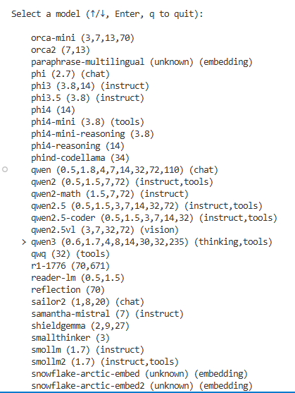
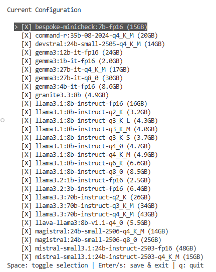
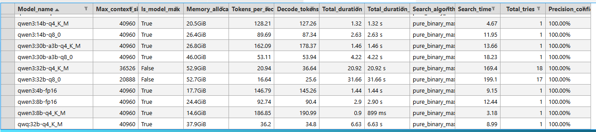
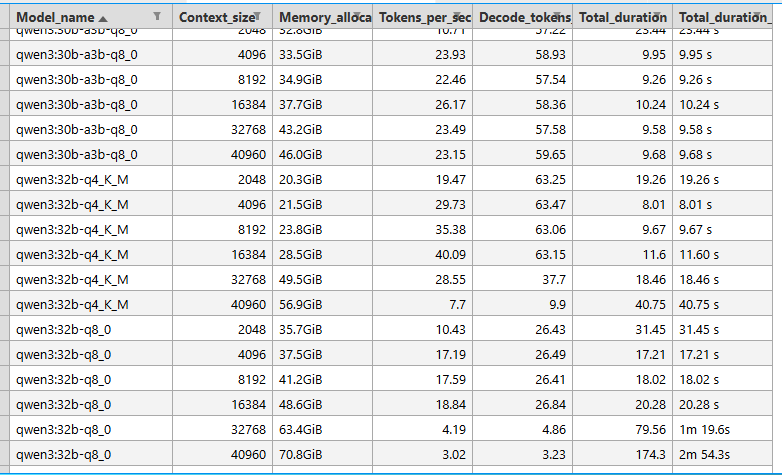

# Ollama Models

Ollama Models is a powerful and extensible command-line toolkit for managing and analyzing Ollama models. Designed for AI practitioners, researchers, and enthusiasts, it streamlines the process of discovering, configuring, and benchmarking models from the Ollama ecosystem.

**Key Features:**
- **Model Discovery & Management:** Fetch the latest model metadata from Ollama, edit and apply custom tag configurations, and synchronize your local environment.
- **Context Analysis:** Probe and report the maximum context window sizes and memory requirements for different models, helping you optimize deployments for your hardware.
- **Automation & Scripting:** Integrate with your workflows using a robust CLI with detailed logging and flexible configuration options.
- **Open & Extensible:** Built with modular Python code, making it easy to extend or integrate with other tools.

**Getting Started:**
There are two main ways to begin managing your Ollama models, depending on your goals:

1. **Start Fresh with a Custom Configuration:**
   - Use `ollama-models model edit` to interactively select the models and tags you want. When you later apply this configuration, Ollama will pull any missing models and remove any that are not in your selection.

2. **Preserve Your Current Ollama Setup:**
   - Use `ollama-models model init` to record your current Ollama model configuration. This lets you capture your existing setup and manage it going forward without making immediate changes.

For step-by-step instructions and advanced usage, see [`ollama_models/README.md`](ollama_models/README.md).

Use `ollama-models model edit` to pick the models you want.

to modify your `ollama_models.conf`

Probe for maximum context based on the available VRAM

Report memory usage per model based on 2^n context sizes up to model's max context size

**Getting Model Data:**
- The package includes a starter `ollama_models.json` file. You can fetch the latest model data from Ollama.com at any time using the `fetch` command. This creates a new file and does not overwrite the original.
- Note: Fetching relies on scraping Ollama.com and may fail if the website changes.

For detailed usage instructions and advanced features, see [`ollama_models/README.md`](ollama_models/README.md).
